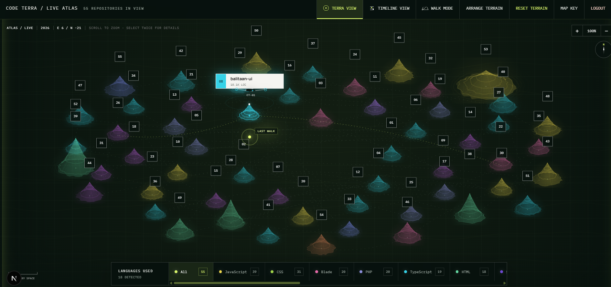
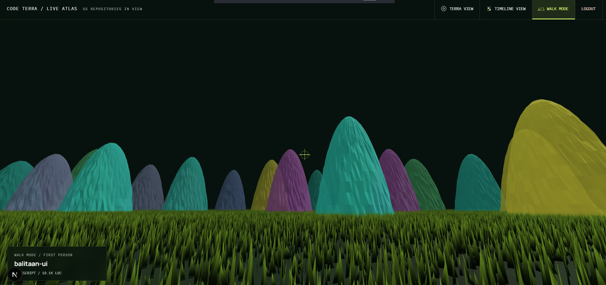
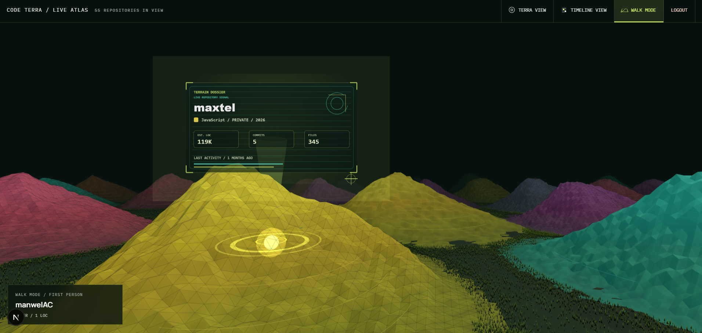
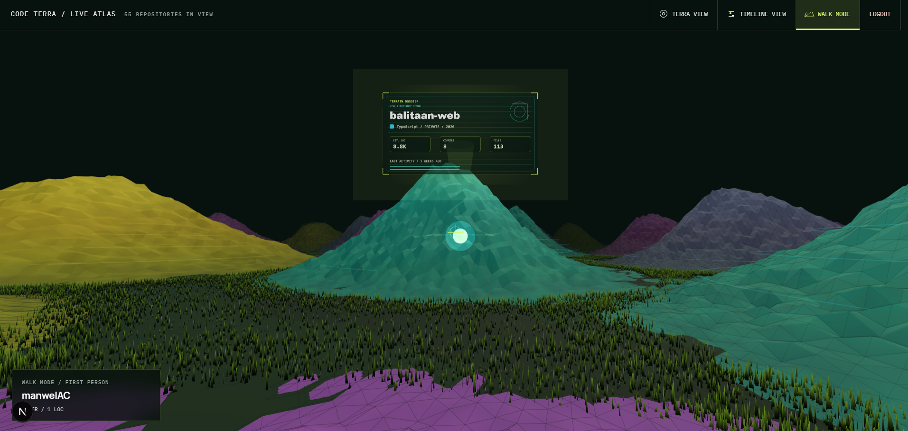
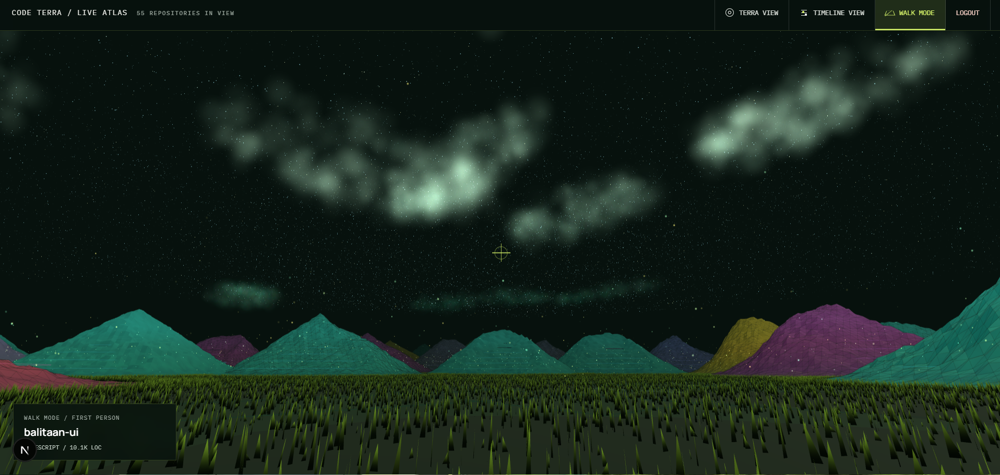

<h1 align="center">
  
</h1>

<strong>Your code, rendered as terrain.</strong>

Code Terra transforms the GitHub repositories you choose into a private, interactive landscape. Every repository becomes a distinct terrain shaped by its size, structure, history, language, and recent activity—turning a list of projects into an atlas you can explore.

## Read the landscape

Code Terra gives familiar repository signals a visual form:

| Terrain signal | Repository data |
| --- | --- |
| Height | Estimated lines of code |
| Footprint | File count |
| Contours | Commit count |
| Glow | Recent activity |
| Color | Primary language |
| Routes | Repository history |

Estimated lines of code are derived from the language-byte totals reported by GitHub, so they are intended as a visual comparison rather than an exact source-line count.

## Featured Development Image

### Phase 1 

<strong>Terra View</strong>

<h1 align="center">
  
</h1>

<strong>Walk Mode</strong>

<h1 align="center">
  
</h1>

### Phase 1.1

<strong>Walk Mode</strong>

<h1 align="center">
  
</h1>

<strong>Click action - Walk mode</strong>

<h1 align="center">
  
</h1>

### Phase 1.2

<strong>Walk Mode</strong>

<h1 align="center">
  
</h1>

### Interactive terrain atlas

Explore every selected repository in one continuous landscape. Pan and zoom across the atlas, select a terrain for more detail, reset the view with the compass, or open the full terrain experience for a focused map view.

### Arrange your world

Move individual terrains to create a layout that makes sense to you. Code Terra remembers the customized arrangement in your browser and lets you restore the original map at any time.

### Repository dossiers

Open a terrain to inspect its repository name, visibility, creation year, latest activity, estimated lines of code, commits, files, and language profile. When available, jump directly from the dossier to the repository on GitHub.

### Landscape through time

Switch to Timeline View to see when repositories entered your world. Projects are grouped by creation year, with totals for terrain count, estimated lines of code, and commits. A year control also lets you view the atlas as it existed at an earlier point in your repository history.

### Language-aware exploration

Code Terra detects the languages used across the connected repositories and builds filters automatically. Isolate a language to see the projects that use it, with language colors and repository counts carried throughout the atlas.

### At-a-glance portfolio view

See aggregate repository, estimated LOC, commit, and file totals, then browse a complete repository index. Selecting a row locates the corresponding project on the terrain.

### Refresh and export

Rescan GitHub to refresh the repository snapshot, or export the mapped repository metrics as a portable JSON file.

## Private by design

Code Terra is built around selective, read-only GitHub access:

- You choose which personal or organization repositories can appear in the atlas.
- GitHub access is read-only; Code Terra never writes to a repository.
- Repository source contents are not stored or returned to the browser.
- Access tokens stay inside an encrypted, HTTP-only session and are not exposed to browser scripts.
- Both public and private repositories can be mapped when you grant access.

Commit and file-tree metrics require read-only Contents permission. If that permission is unavailable, Code Terra keeps the repository visible and clearly marks the affected metrics instead of inventing values.

## From GitHub to terrain

1. Connect your GitHub identity.
2. Choose the repositories Code Terra may read.
3. Enter the atlas and explore your repository landscape.

Repository access can be reviewed or changed through GitHub at any time.
